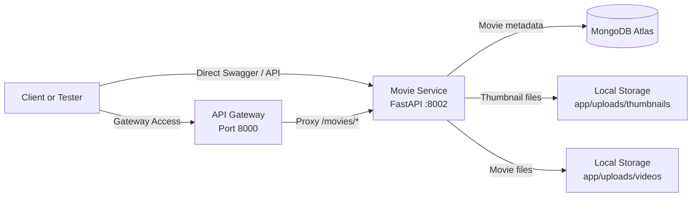

# 🎬 Movie Service

Backend implementation of the **Movie Service** for the Movie Streaming Platform assignment.

## 👤 Owner

- **Rathnasinghe S J R (IT22908124)**

## 📖 Overview

This branch contains the complete backend implementation for the **Movie Service** microservice.  
It is built with **FastAPI** and **MongoDB Atlas** and supports both:

- direct service access on port `8002`
- API Gateway access through port `8000`

## 🧭 Service Diagram



## 🎯 Scope

This service is responsible for:

- adding a new movie
- updating movie details
- deleting a movie
- getting all movies
- getting a movie by ID
- searching movies by title or category
- filtering movies by category

## 🛠️ Tech Stack

- **FastAPI**
- **Uvicorn**
- **MongoDB Atlas**
- **Motor**
- **python-multipart**

## 💾 Storage Design

- Movie metadata is stored in **MongoDB Atlas**
- Thumbnail files are stored locally in `app/uploads/thumbnails`
- Movie files are stored locally in `app/uploads/videos`

## 🗂️ Project Structure

```text
app/
  core/
  db/
  routes/
  schemas/
  services/
requirements.txt
.env.example
README.md
```

## 🔗 Direct Service URLs

- Base URL: `http://localhost:8002`
- Movie API: `http://localhost:8002/api/movies`
- Swagger UI: `http://localhost:8002/docs`
- ReDoc: `http://localhost:8002/redoc`
- Health Check: `http://localhost:8002/health`

## 🌐 API Gateway Access

If the API Gateway is running on port `8000`, this service can also be accessed through:

- Gateway Swagger: `http://localhost:8000/movies/docs`
- Gateway Movie API: `http://localhost:8000/movies/api/movies`

## ✅ Features Implemented

- `GET /api/movies`
- `GET /api/movies/{movie_id}`
- `POST /api/movies`
- `PUT /api/movies/{movie_id}`
- `DELETE /api/movies/{movie_id}`
- `GET /health`

## 📥 Request Details

### Create or Update a Movie

The API accepts:

- `title`
- `category`
- `thumbnail` as an uploaded image file
- `movie_file` as an uploaded video file

### Supported Thumbnail Formats

- `.jpg`
- `.jpeg`
- `.png`
- `.webp`

### Supported Video Formats

- `.mp4`
- `.mov`
- `.mkv`
- `.avi`
- `.webm`

## ⚙️ Environment Variables

Copy `.env.example` to `.env` and configure your values.

Required variables:

- `PORT=8002`
- `MONGODB_URI=your_mongodb_atlas_connection_string`
- `MONGODB_DB=movie_system`
- `GATEWAY_BASE_URL=http://localhost:8000/movies`

## 🚀 Setup

1. Install dependencies:

```bash
pip install -r requirements.txt
```

2. Run the service:

```bash
uvicorn app.main:app --reload --host 0.0.0.0 --port 8002
```

## 🧪 Swagger Testing

1. Start the Movie Service on port `8002`
2. Open `http://localhost:8002/docs`
3. Test `POST /api/movies` to create a movie
4. Use the returned `id` to test `GET`, `PUT`, and `DELETE`
5. Open `http://localhost:8000/movies/docs` to test the same service through the API Gateway

## 📝 Notes

- This branch is focused only on the **Movie Service backend**
- Frontend and admin-panel code are intentionally excluded from this branch
- The API Gateway itself is not included in this branch, only the integration path expected for access
